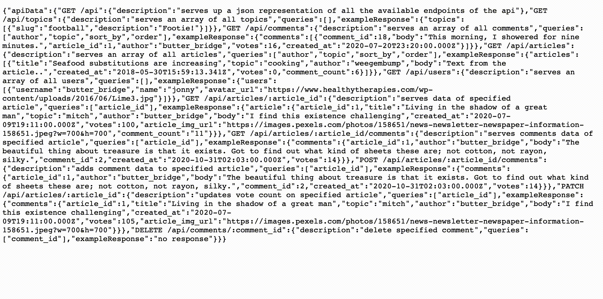

## PROJECT TITLE
NC News API

## DESCRIPTION 
NC News API is a backend service designed to simulate the core functionalities of a news website. This API provides access to a PostgreSQL database through a variety of endpoints, allowing users to interact with data related to articles, comments, topics, and users. It offers features such as fetching all available endpoints, listing topics, comments by various filters, articles with detailed attributes including comments, and user information. The API supports operations such as adding new comments to articles, updating article votes, and deleting comments, making it a comprehensive backend solution for news-related applications.

## FUTURE DEVELOPMENT
A frontend project is intended for development that will utilise this API and all of its features.

## LIVE DEMO
Please find a live demo of this project here:  
[https://nc-news-api-ilr4.onrender.com](https://nc-news-api-ilr4.onrender.com)  
For a list of all endpoints with their functionality visit:  
[https://nc-news-api-ilr4.onrender.com/api](https://nc-news-api-ilr4.onrender.com/api)  
Please note that the current hosting option requires around 1 minute for initial spin up.

## FEATURES  

Features include: 

- **COMPREHENSIVE ENDPOINT OVERVIEW**: A `GET /api` endpoint that serves up a JSON representation of all available endpoints of the API, providing users with a roadmap of its functionalities.  
- **TOPICS EXPLORATION**: Through `GET /api/topics`, users can fetch an array of all topics, enabling a broad view of news categorization.  
- **FLEXIBLE COMMENTS RETRIEVAL**: `GET /api/comments` allows fetching comments with optional queries like author, topic, sort_by, and order, offering versatile viewing options.  
- **ARTICLES ACCESS**: Users can access all articles via `GET /api/articles`, with support for filtering by author, topic, sorting, and ordering. This endpoint enhances content discoverability.  
- **USER PROFILES**: The `GET /api/users` endpoint serves an array of all users, providing insights into the community contributing to and engaging with the news content.  
- **ARTICLE DETAILING**: Fetch detailed data of a specific article using `GET /api/articles/:article_id`, which includes comprehensive article information and associated comments.  
- **COMMENTING ON ARTICLES**: Users can add comments to specific articles using `POST /api/articles/:article_id/comments`, facilitating interactive discussions.  
- **VOTE UPDATING**: The API supports updating vote counts on articles via `PATCH /api/articles/:article_id`, allowing users to express their opinions on content.  
- **COMMENT MANAGEMENT**: Users have the ability to delete specific comments through `DELETE /api/comments/:comment_id`, providing control over the discussion environment.

For a full list of features, please reference: [NC-News-API/endpoints.json](endpoints.json)

## INSTALLATION INSTRUCTIONS

**Cloning the Repository:**
`git clone https://github.com/xiamonder/NC-News-API`

**Installing Dependencies:**
`npm install`

**Setting Up the Local Databases:**
`npm run setup-dbs`

**Seed the database with initial data:**
`npm run seed`

## Environment Configuration

**IMPORTANT** Please create necessary .env files for the databases before attempting to run setup:

**.env.test**
`PGDATABASE=your_test_database_name_here (nc_news_test)`

**.env.development**
`PGDATABASE=your_database_name_here (nc_news)`

If you want to setup with a hosted database, pleas add the additional file:

**.env.production**
`DATABASE_URL=your_database_url_here`

This project includes both the development database and the test database. If you wish to set up your own database, please reference: NC-News-API/db/seeds/seed.js for details on table requirements.

Please note that the current testing suite has been setup with the test database in mind. It is recommended that the test database is used for testing purposes.

## SYSTEM REQUIREMENTS
- **Node.js**: This project requires Node.js version 16.0.0 or higher.  
- **Postgres**: PostgreSQL version 8.11.3 or higher is needed.

## PACKAGES 
- **dotenv**: Configures environment variables for database connections and other sensitive info.  
- **express**: Powers the API server, defining routes and middleware for handling requests and responses.  
- **pg and pg-format**: Enables interaction with the PostgreSQL database, executing SQL queries.  
- **jest, jest-extended, jest-sorted, and supertest**: Provides a comprehensive testing framework for the application's functionality.  
- **husky**: Creates pre-commit git hooks to ensure that all submitted code is functioning correctly.

## TESTING 
A full testing suite is included as part of this project. Tests have been built with jest and supertest to ensure comprehensive coverage and functionality validation. Please setup 
`nc_news_test` as detailed in environment configuration before attempting tests.

**Run App Tests**
`npm t app`

**Run Util Tests**
`npm t util`

**Run all tests**
`npm t`

## CONTRIBUTING
This project is not currently open to direct contributions although suggestions for improved functionality/additional features are welcome! Please feel free to clone/fork this project and make use of it for your own testing/learning!

## AUTHORS AND ACKNOWLEDGMENTS 
This project was created as part of the Northcoders Software Development bootcamp. All of the tutors were incredibly helpful in the learning journey and their feedback whilst building this project was invaluable.

## DEMO

## SUPPORT 
For more help or information, please submit issues [here](https://github.com/xiamonder/NC-News-API/issues).
