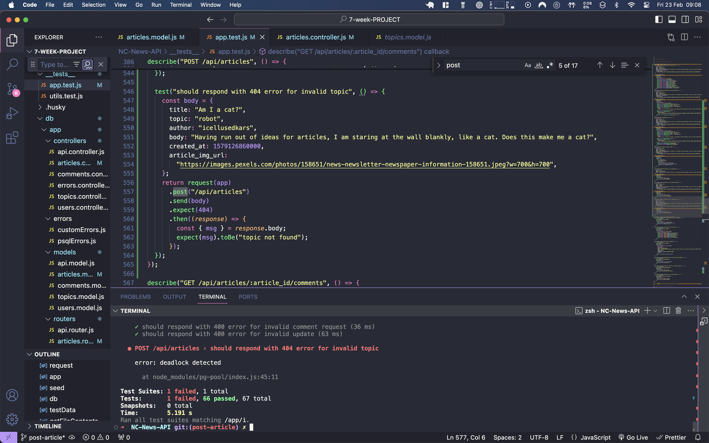
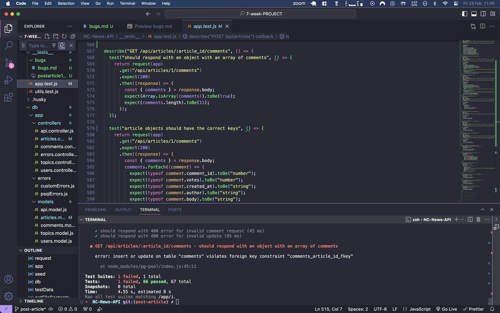
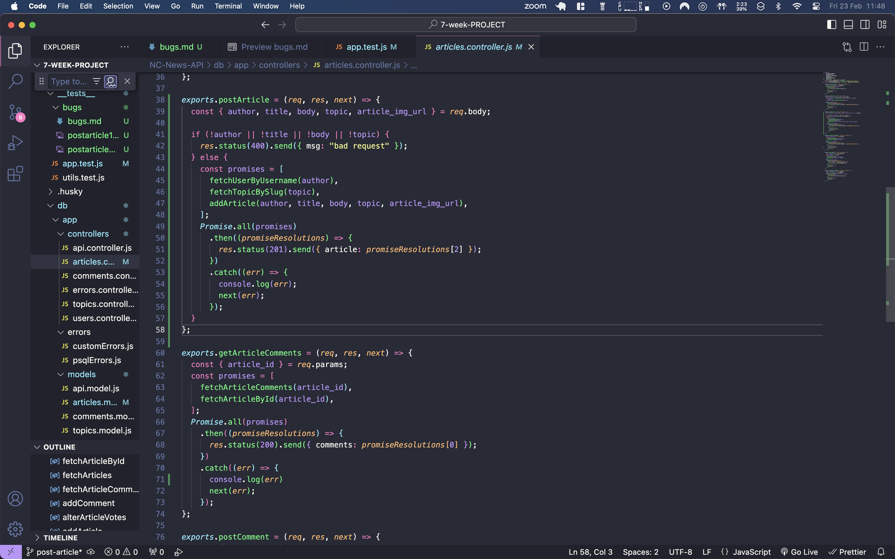
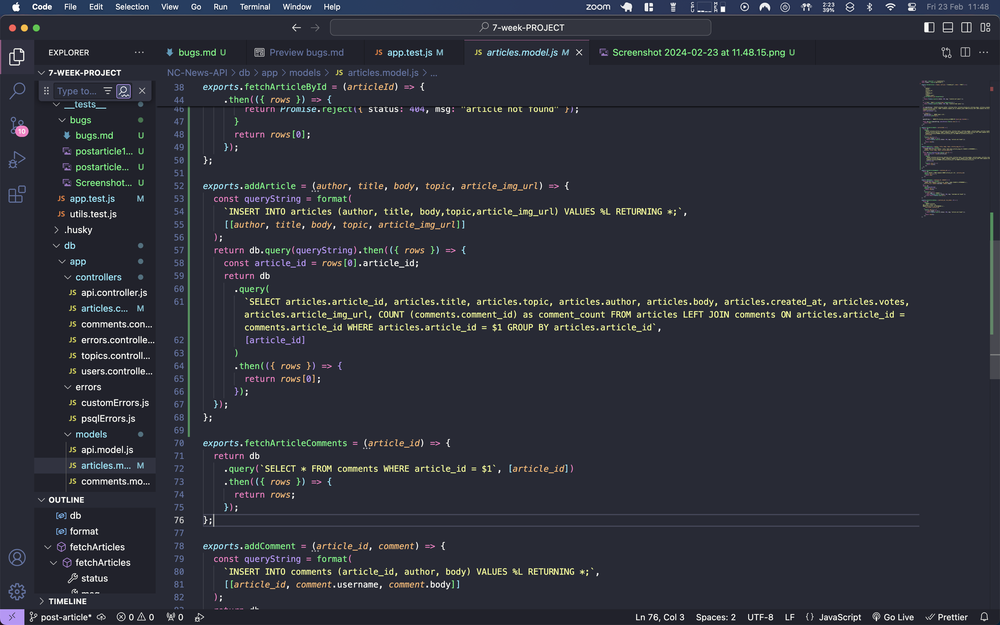
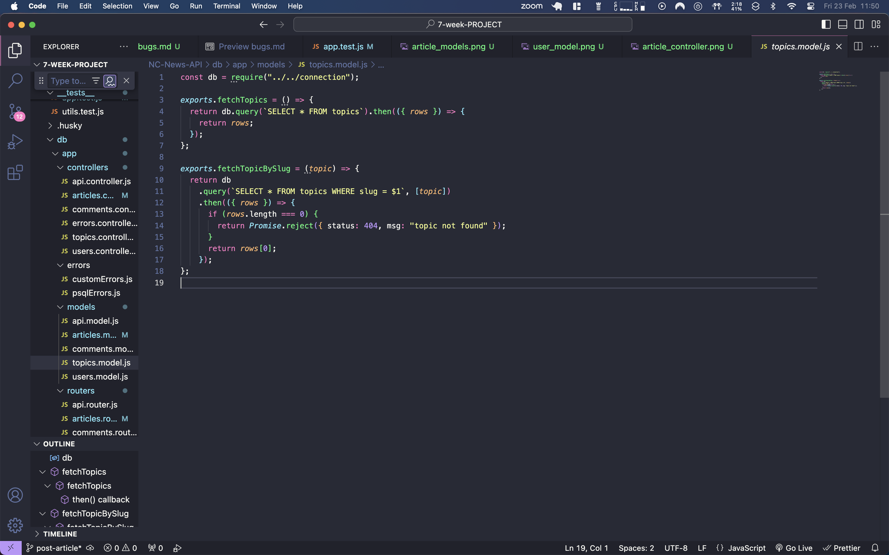
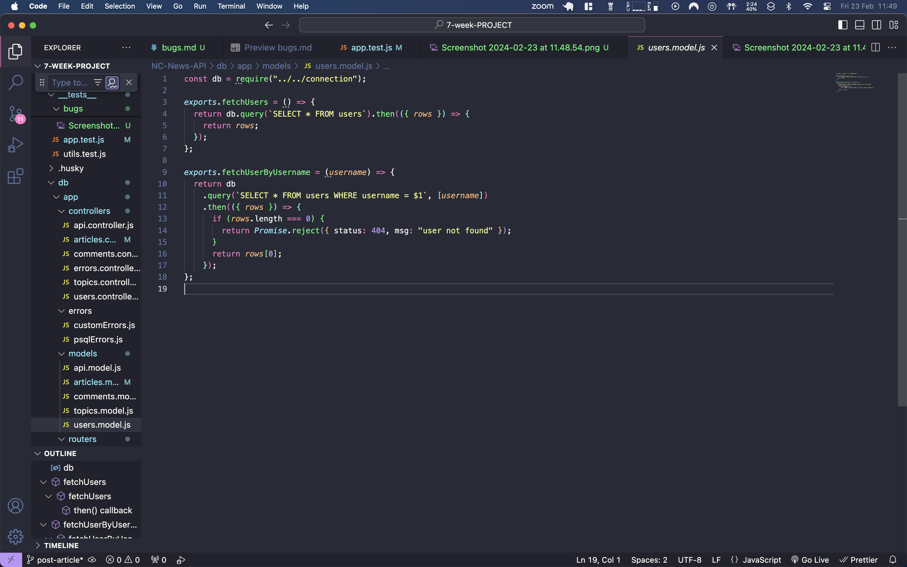

## bugs log

### POST article [SOLVED]

**SOLUTION**
Originally, in order to recieve specific custom erros I set up a promise array of 3 database calls (getTopics, getUsers, and the main action postArticle). Whilst this worked in isolation, it caused the strange behaviour detailed below. Some research suggested that when ran alongside other tests the mix of 2 gets and a post requests in a single promise array could be the issue. I refactored the code to be an initial promise array of get requests and a post request only if they are successful. This has solved the issue.

**ORIGINAL ERROR**
Only started occuring after the implementation of this feature. Seems to be specifically related to its handling of 400 errors.

Tests pass individually and as parts of describe block. When all tests are run there are two intermittent failures that occur, never in the same run.

**Error 1 - Deadlock on 404 Topic for POST article**

**Error 2 - Foreign Key Fail for GET article comments**

Error 2 appears to be more frequent and is also stranger as this is a test that is unrelated to post article and was implemented very early on in development. It has never caused issues before.

Initially I had no issues but refactored code as I was looking for more descriptive error handling (400 if neccessary info missing, 404 topic not found for invalid topics, 404 user not found for invalid user). The bug may be related to the if statement implemented to achieve this. It is worth noting that the 400 test does not fail despite the bug only occuring after additional steps taken in relation to it. Disabling this test does not solve the problem.

Due to everything working in isolation and the majority of the time with all tests running, it has been recommended to temporaily move on and return to this issue later. 

**Involved Code**

